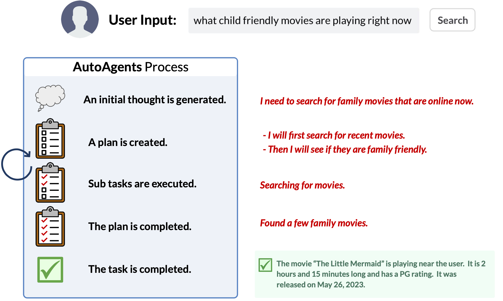

## Overview

The purpose of this project is to explore and extend the limits of LLMs problem-solving skills regarding complex tasks.

Inspired by AutoGPT, we are interested in building real applications that can generate well-thought-out plans and use the right tools to solve problems for hobbyists and businesses alike.

We are excited to release the initial version of AutoAgents, a proof-of-concept search agent that collects information on your behalf via simply well-written prompts.
 
Come try out our [Huggingface Space](https://huggingface.co/spaces/AutoLLM/AutoAgents)! Or check out the local deployment instructions [here](./docs/repo-howto.md).

## The AutoAgents Project

This project demonstrates LLMs capability to execute a complex user goal: understand a user's goal, generate a plan, use proper tools, and deliver a final result.

For simplicity, our first attempt starts with a Web Search Agent.

## How it works:

## Some initial findings:
1. How far can a better prompting strategy contribute?
2. What are the major gaps in a prompt-only system
3. What future directions need to be understood to create such a system

If you are interested in what we find out, sign up for our mailing list here. We are planning to write a blog post to talk about what we learn.

## Hey! Yet Another Auto LLM project?

True! There are a few attempts on this problem. Our methodology is to start with a smaller scope and try to make something that just works!

Concretely, we are interested in:
* Smart, Efficient and Robust Planning
* Accurate tool selection and execution
* High task completion success rate

Last but not least, we are building towards fine-tuned open source LLMs that you can deploy locally! Checkout our road map below, and stay tuned for our model releases!

## Examples

Ask your AutoAgent to do what a real person would do using the internet:

E.g.
1. Recommend a kid friendly movie that is playing at a theater near Sunnyvale. Give me the showtimes and a link to purchase the tickets
2. What is the average age of the past three president when they took office
3. What is the mortgage rate right now and how does that compare to the past two years

## What’s Next?

* AutoAgents [7B] Model
  * Initial Release:
    * Finetune and release a 7B parameter fine-tuned search model
* AutoAgents Dataset
  * A high-quality dataset for a diverse set of search scenarios (why quality and diversity?[1](https://arxiv.org/abs/2305.11206))
* Reduce Model Inference Overhead
* Affordance Modeling [2](https://en.wikipedia.org/wiki/Affordance)
* Extend Support to Additional Tools
* Customizable Document Search set (e.g. personal documents)
* Support Multi-turn Dialogue
* Advanced Flow Control in Plan Execution

We are actively developing a few interesting things, check back here, sign up for the mailing list, or follow us on [Twitter](https://twitter.com/AutoLLM) for any new development.
 
If you are interested in any other problems, feel free to shoot us an issue.

